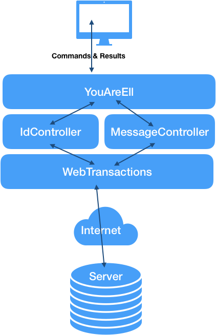

# Under-A-Rock

## Client HTTP/REST API for UnderARock

You'll write a Client to exchange JSON data over HTTP with a Server, in this case, the UnderARock(TM) server.

**DO YOU HAVE POSTMAN YET? No? Download it now.**

### The Point

* You are to write a command interpreter using the provided `YouAreEll` class.
* You're going to create a way
	* for commands to be typed into your shell,
	* to read the typed commands and arguments,
	* to send them off to the Under-A-Rock server using a REST API over the HTTP protocol,
	* to read the JSON data returned from the URL call,
	* to print it out nicely formatted for your user. 

* `Under-A-Rock` acts a little (very little) like a twitter server or chat server.
	* You register your name and github id by creating an ID JSON payload (see below) and POSTing it to the server.
	* You can GET all the ids registered by sending a GET request to the same URL.
	* Once you've received all the ids, you can send messages to the world or to a specific `Github_id`.


* You can send a message to the global timeline by POSTing a Message JSON object to the URL below.
	* If you leave the `to id` field empty, the message is `to the world`.
	* If you fill out the the JSON template with a valid github_id in the `to id` field of the JSON payload, then that message is addressed to that friend.
	* Yes, all messages can be seen by users of the system.
	* There are JSON templates below for both Ids and Messages.


* When you send a new Message or Id JSON object to the server, it records it, and fills in one or two fields. 
	* A Message gets an assigned sequence number and a timestamp of when it was received by the server.
	* An ID object gets a "user id" field assigned to it.
	* Any sequence number, timestamp or userid you put into a JSON template gets overwritten by the server when you POST it. 

Use POSTMAN (the app) to play with calling a couple of the URLs to the server.

The overall architecture of ths project has been done for you. It uses the model/view/controller concepts.



You will need to write the code for each layer, and wire it up using dependency
injection.

* You'll make a couple very simple POJO (plain old java objects) model objects for Id and Message.

* You're going to create a series of REST API clients that will each perform a 
specific command from the controllers.
	* Each one of the command methods will then call a even lower-level methodin WebTransactions that makes a certain kind of HTTP request (GET, POST, PUT) to specific filled-in URL.

* The Under-A-Rock Server can be reached at `http://zipcode.rocks:8085` Everyone uses the same server. 		
	* There are two segments to the API and two kinds of commands in the shell, the ID segment and the Messages segment.


* You can explore several ways of doing the HTTP URL calls to the server inside of WebTransactions, using the one of these:
	* [Apache HTTP Client Library](http://hc.apache.org/httpcomponents-client-ga/index.html)
	* [Unirest for Java](http://unirest.io/java.html)
	* [Square's OKHttp](https://github.com/square/okhttp)
	* Core Java:
		* [URL](https://docs.oracle.com/javase/8/docs/api/java/net/URL.html)
		* [HttpURLConnection](https://docs.oracle.com/javase/8/docs/api/java/net/HttpURLConnection.html)

* Be prepared to defend your choice if which HTTP client library you chose, with reasons why you chose it.
	* You should also create some unit tests for your REST API handlers.

* It's possible you may also need to understand some of what the [Jackson package](https://github.com/FasterXML/jackson) does.

* You'll create a couple "views" to print out the current information from each command
on the user's behalf. ALL I/O between the user and your program should be entirely in the 
YouAreEll class. No printlns in any other class (except for debugging.)

* You should write some simple tests to prove your classes work.

## IDs

This is the stuff your controllers should know how to do.

#### ID commands in shell

* In the shell, `ids` should return a formatted list of the IDs available to you.
* `put-id your_name your_github_id` command should post your Name and your GithubId to the server.
* If you do this twice with two different Names, but the name GithubId, the name on the server gets changed.

-
### The IDs API is:

#### URL: /ids/

* `GET` : Get all github ids registered
* `POST` : add your github id / name to be registered
* `PUT` : change the name linked to your github id

json payload for /ids/ - this is a sample

```json
{
    "userid": "-", // gets filled w id
    "name": "Kris",
    "github": "xt0fer"
}
```
 
#### Example: 

If I type `cmd? put-id Kris xt0fer` into the shell, your command processor creates a JSON object which looks like:

 ```json
 {
     "userid": "-", // gets filled w id from server
     "name": "Kris",
     "github": "xt0fer"
 }
 ```
and send it as the body of a POST request to  `http://zipcode.rocks:8085/ids/`

 
## Messages

#### Message comands in shell
in the shell
* `messages` should return the last 20 messages, nicely formatted.
* `messages your_github_id` should return the last 20 messages sent to you.
* `send 'Hello World' ` should post a new message in the timeline
* `sendto some_friend_githubid 'my string message'` should post a message to your friend from you on the timeline.

the Messages API is:

#### URL: /messages/
* `GET` : Get last 20 msgs - returns an JSON array of message objects

#### URL: /ids/:mygithubid/messages/
* `GET` : Get last 20 msgs for myid  - returns an JSON array of message objects
* `POST` : Create a new message in timeline - need to POST a new message object, and will get back one with a message sequence number and timestamp of the server inserted.

#### URL: /ids/:mygithubid/messages/:sequence
* `GET` : Get msg with a sequence  - returns a JSON message object for a sequence number

#### URL: /ids/:mygithubid/from/:friendgithubid
* `GET` : Get last 20 msgs for myid from friendid

json payload for /messages/ these are samples, one to a specific friend, one to the timeline.

```json
[
  {
    "sequence": "-",
    "timestamp": "_",
    "fromid": "xt0fer",
    "toid": "kristofer",
    "message": "Hello, Kristofer!"
  },

  {
    "sequence": "-",
    "timestamp": "_",
    "fromid": "xt0fer",
    "toid": "",
    "message": "Hello, World!"
  }
]
```

#### Example: 
 
if I type 
``` cmd?
send xt0fer 'Hello old buddy!' to torvalds
```
into the shell, your command processor creates a JSON object which looks like:

 ```json
{
	"sequence": "-",
	"timestamp": "_",
	"fromid": "xt0fer",
	"toid": "torvalds",
	"message": "Hello old buddy!"
}
 ```
and send it as the body of a POST request to  `http://zipcode.rocks:8085/ids/xt0fer/messages/`


## Part Two

Build a better set of commands. Make the "fromid" intrinsic, so it isn't needed on the various shell commands.
Add a feature where you can send messages by someone's name. Create a means where the client watches the server for 
any private messages to you and only prints them once. 
Add another command that watches the global stream and only prints messages once.


